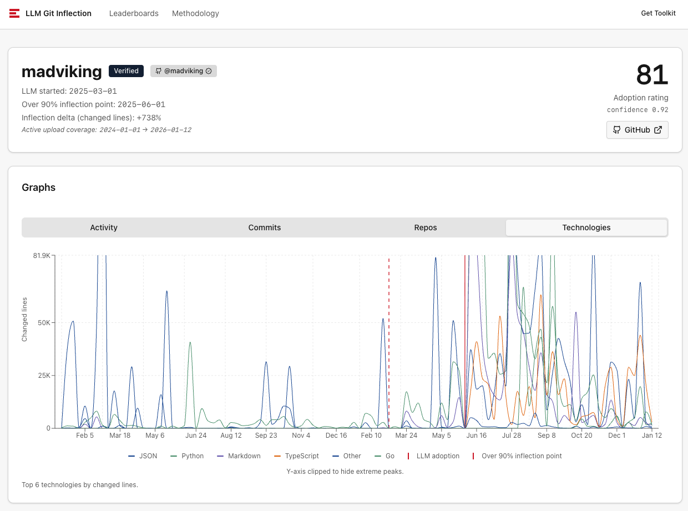

# git-analysis

Generate Git activity stats for one or more calendar years (or custom periods) across many local repositories under a directory tree.

The tool is **read-only**: it shells out to `git` and produces reports under `reports/`.

## Install

Requirements:
- Python 3.11+
- Git on PATH
- `uv` (required for `./cli.sh`): https://docs.astral.sh/uv/ (e.g. `brew install uv`)

## Run

```bash
./cli.sh --root .. --years 2024 2025
```

On first run, if `config.json` is missing, it is created from `config-template.json` (with inferred identity and scanned repo remotes) and you’ll be prompted to review it.

## Configure

Edit `config.json` to:
- define who counts as “me” (`me_emails` recommended)
- limit which repos are included (`include_remote_prefixes`, `excluded_repos`)
- exclude generated/vendored paths from churn totals (`exclude_path_prefixes`, `exclude_path_globs`)

More: `docs/configuration.md`.

## Output

Each run writes a report folder under `reports/<run-type>/<timestamp>/` and updates `reports/latest.txt`.

More:
- `docs/output.md`
- `docs/report-walkthrough.md`

## Publish to web (optional)

If you upload your “me” stats to a compatible backend (example: https://gitstats.east.fi/), you get a shareable public profile page with adoption score, inflection dates (if provided), and interactive graphs.

Uploads contain only your own (“me”) stats and contain no repo identifiers/URLs.




More: `docs/publishing.md`.

### Example of an embeddable card


## Documentation

- `docs/index.md`
- `docs/cli.md`
- `docs/troubleshooting.md`
- `docs/configuration.md`
- `docs/output.md`
- `docs/report-walkthrough.md`
- `docs/publishing.md`
- `docs/upload-payload.md`
- `docs/development.md`

## Development

```bash
uv sync --group dev
.venv/bin/python -m pytest
```

